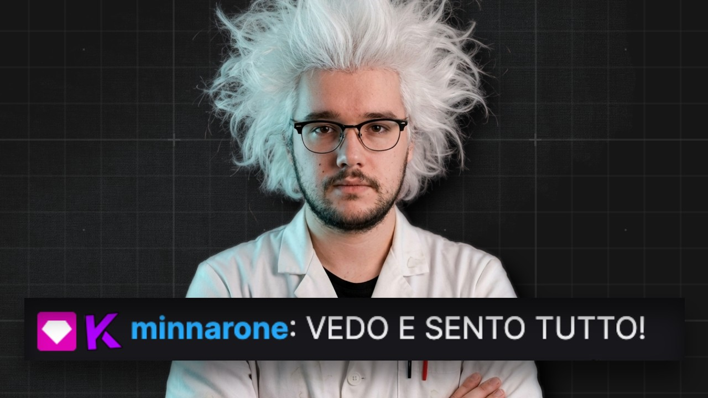

> 🇮🇹 [Versione italiana](README.it.md)

# Minnarone Framework

<p align="center">
  <a href="https://www.youtube.com/watch?v=EkunaRO0uKg">
    
  </a>
</p>
<p align="center"><em>Cover of <a href="https://www.youtube.com/watch?v=EkunaRO0uKg">enkk's origin video</a>.</em></p>

A reusable framework for building AI agents that **perceive a live multimodal context** (audio, video/screen, chat, platform events) and **react proactively** — both as a public participant (streamer co-host, group commentator) and as a private assistant (suggestions for sellers, presenters, meeting participants).

It grew out of the generalization of **Minnarone**, a bot that watched Twitch live streams and interacted in chat in a way indistinguishable from a human.

## Origin and credits

Minnarone was conceived and built by **enkk**, its original author and designer: a bot able to listen to and watch a Twitch live stream and to interact in chat with other users and with the streamer without anyone realizing they were talking to an artificial intelligence (a kind of Turing test applied to chat).

- **Origin video**: <https://www.youtube.com/watch?v=EkunaRO0uKg>
- **Transcript**: [`docs/source/transcript.md`](docs/source/transcript.md) — the transcript of enkk's video from which the specification of this framework was derived.

This repository generalizes that idea into a reusable framework: the same perception + reaction engine serves different use cases (Twitch, Teams meetings) by changing only the configuration.

## Documentation

- **[Project specification](docs/SPECIFICATION.md)** — requirements, user stories, use cases, edge cases, system design and roadmap.
- **[Twitch operator guide](docs/twitch-operator.md)** — capture smoke, VAD diagnostics, `adapter: twitch` runtime and enabling public send (shadow/live).
- **[Meeting assistant guide](docs/meeting-assistant-operator.md)** — synthesizer and suggester profiles on Teams via `adapter: os_capture`.
- **[Source material](docs/source/)** — transcript and screenshots from which the specification was derived.

## Running the reference app

The "Minnarone" app starts from a YAML **configuration file** (soul, facts,
adapter, provider, cadences, mode) — without writing code.

**Prerequisites**: Python 3.11+ (3.12 recommended — see `.python-version`).

First create and activate a virtual environment. With
[uv](https://docs.astral.sh/uv/) (recommended):

```bash
uv venv                             # create .venv
source .venv/bin/activate           # Windows: .venv\Scripts\activate

uv pip install -e .                 # core
uv pip install -e '.[tui]'          # + observability dashboard (textual)
uv pip install -e '.[audio]'        # + Twitch audio runtime: faster-whisper + sherpa-onnx (ASR + speaker)
uv pip install -e '.[video]'        # + Twitch video runtime: Streamlink Python + PyAV
uv pip install -e '.[vlm]'          # + captioning `vlm.backend: qwen`: transformers + torch/torchvision + Pillow
uv pip install -e '.[vlm-llamacpp]' # + captioning `vlm.backend: llamacpp`: Pillow only (via multimodal llama-server, no torch)
uv pip install -e '.[os-capture]'   # + system audio capture (soundcard) and screen capture (mss)

# Validate the config and build the agent (dry-run, no loop, no network):
python -m minnarone path/to/config.yaml --check

# Start the live reaction loop:
python -m minnarone path/to/config.yaml

# Start with the observability TUI dashboard (requires the `tui` extra):
python -m minnarone path/to/config.yaml --tui

# Replay a past run or a perceptions.jsonl offline (replay dashboard):
python -m minnarone --replay <run_dir_or_perceptions.jsonl>
```

Prefer plain `pip`? Create the venv with the stdlib
(`python -m venv .venv`), activate it, then drop the `uv` prefix
(`pip install -e '.[tui]'`). Note: a `uv venv` does **not** ship `pip`, so use
`uv pip` with it. The run commands above assume the venv is activated (or
prefix them with `uv run`).

The extras can be combined (e.g. `uv pip install -e '.[os-capture,audio,vlm]'`)
and can also be installed with `uv sync --extra <name>`.

> **First `--check`**: the Twitch/Teams examples validate that setup exists, so
> they error out of the box. Twitch adapters need `TWITCH_BOT_USERNAME` /
> `TWITCH_OAUTH_TOKEN` in `.env` (`cp .env.example .env`); the OS-capture and
> Teams examples need a local speaker-embedding ONNX model
> (`speaker_embedding.model_path`) — see the sections below.
> `examples/llamacpp-local.example.yaml` passes `--check` with no extra setup.

## Secrets via `.env`

The CLI loads a `.env` file **at startup**, before reading the secrets: first
next to the config file, then in the `cwd`. Variables already exported in the
terminal take precedence over the file (standard dotenv semantics). The loader is
minimal and zero-dependency; `.env` is gitignored — never commit real
values. The template is [`.env.example`](.env.example) (`cp .env.example .env`).

| Variable | When it is needed |
|-----------|--------------|
| `OPENROUTER_API_KEY` | With `llm_provider: grok`/`deepseek` (OpenRouter). NOT needed with `llm_provider: llamacpp` (local LLM). |
| `TWITCH_BOT_USERNAME` | With `adapter: twitch` + `twitch.chat: true` (read-side IRC ingestion). |
| `TWITCH_OAUTH_TOKEN` | With `adapter: twitch` + `twitch.chat: true` — **read** token (`chat:read chat:edit`). |
| `TWITCH_SEND_OAUTH_TOKEN` | **Only** for `twitch.send.mode: live` — **write** token of a dedicated bot account. |

The read token and the write token are deliberately distinct: a read-only
config must never have the power to send messages. The presence of the write
token is verified when the agent is built; the value never enters logs, errors
or artifacts.

## Quality checks

```bash
uv sync --extra dev
make quality

# enable the pre-commit git hook tracked in the repo
git config core.hooksPath .githooks
```

The target runs Ruff, Vulture, Deptry and Pylint limited to `duplicate-code`
(`R0801`).

### Runtime prerequisites

- **`OPENROUTER_API_KEY`**: put it in `.env` (or export it into the environment).
  Not needed with `llm_provider: llamacpp` (see [local LLM](#local-llm-llamacpp)).
- **macOS permissions**: perception capture requires authorizing the
  process (e.g. the terminal) in *System Settings → Privacy & Security*
  for **Microphone** (audio) and **Screen Recording** (video/screen). System
  audio may require additional tooling (loopback). Without the permissions the
  reaction loop runs but receives no perceptions.

### Live perception loop (adapter)

`Agent.run()` runs three things CONCURRENTLY: the reaction loop, the Summarizer
loop (short-term memory, `summarizer_interval` cadence) and the
*perception pump*, which routes every adapter `RawEvent` to the perceiver of
its channel (`chat`/`audio`/`video`) → store.

- The **chat** channel is always wired (no model): `adapter: twitch`
  builds the Twitch runtime from the config and the credentials in the
  environment.
- The **audio** channel uses local VAD + faster-whisper + `sherpa-onnx` speaker
  embedding when `twitch.audio: true` (or `os_capture.audio: true`) and the
  local backends are installed/configured.
- The **video** channel uses Streamlink + PyAV + a local captioning backend
  when `twitch.video: true` and the `video` extra is installed. The backend is chosen
  by `vlm.backend`: `qwen` (Qwen2-VL torch, requires `vlm.model` + the `vlm` extra) or
  `llamacpp` (multimodal llama-server, lightweight `vlm-llamacpp` extra).
- The **`os_capture`** adapter (mic + system loopback audio + screen
  recording) observes the local machine instead of a remote stream.

## Output mode and commentator

The **`mode` switch** is only configuration (same engine):

- `public` routes the output to the public channel (console and, if enabled,
  `twitch.send`). On Twitch in public mode the persona is **always**
  `original_chat` (see below).
- `private` keeps the output on only the **local console** (`[PRIVATE]`):
  no public message is ever sent, regardless of `twitch.send`.

The local commentator is configured with `commentator.profiles`: a dictionary of
**profiles** indexed by style. A present profile activates the corresponding
reactor; an empty profiles dictionary = commentator off. The old
`commentator.enabled` flag no longer exists.

| Style (`commentator.profiles.<style>`) | What it does | Mode |
|----------------------------------------|---------|----------|
| `operator` | Private local play-by-play/commentary for the operator. | `private` |
| `original_chat` | Public persona for Twitch chat (`RE:`/`MSG:` contract). | `public` (Twitch) or `private` (local dry-run) |
| `meeting_synthesizer` | Periodic structured summaries of a meeting. | `private` |
| `suggester` | Contextual suggestions on every perception. | `private` |

`meeting_synthesizer` and `suggester` require `mode: private` (validated at
`--check`). On `adapter: twitch` + `mode: public` only `original_chat` is allowed:
a different profile is rejected with a clear error.

## Public output in Twitch chat (`twitch.send`)

Public send in chat is **gated** and off by default. The
`twitch.send` block (inside `twitch:`) has three modes:

- `off` (default): no `PRIVMSG` sent.
- `shadow`: a dry run without network — the agent decides what it would write but
  sends nothing. It is the recommended break-in step (shadow-first).
- `live`: real send to chat.

Guardrails (conservative defaults): channel **allow-list** (`allowed_channels`;
`mode: live` requires the channel to be in the list), **budget** well below
Twitch's IRC limits (`max_per_minute: 1`, `max_per_hour: 20`), **kill-switch** with
auto-degrade to shadow after `failure_threshold` consecutive failed sends (default
3), and a **separate write token** (`TWITCH_SEND_OAUTH_TOKEN`) of a
dedicated bot account. In the TUI the operator has the commands `k` (kill-switch) and `p`
(promote). Full procedure in the [Twitch operator guide](docs/twitch-operator.md).

## Local commentator on Teams (OS capture)

Minnarone can act as a **local commentator** or **meeting assistant** on a
Teams call you take part in: it observes the **system audio** (the voices of the other
participants, captured from the audio-output loopback) and the **screen** (slides,
faces, shared text), and produces output only on the **local console**
(`[PRIVATE]`). It sends nothing into the meeting: no message, no
audio, no public output.

Ready-to-use presets:

- [examples/teams-commentator.yaml](examples/teams-commentator.yaml) — `operator` profile.
- [examples/teams-meeting-assistant.yaml](examples/teams-meeting-assistant.yaml) — `meeting_synthesizer` + `suggester` profiles.
- [examples/teams-meeting-full.yaml](examples/teams-meeting-full.yaml) — full configuration.

Operational details (profiles, TUI, troubleshooting) in the
[meeting assistant guide](docs/meeting-assistant-operator.md).

### Installation

OS capture lives in the `os-capture` extra (system audio via `soundcard`,
screen via `mss`):

```bash
pip install -e '.[os-capture]'   # oppure: uv sync --extra os-capture
```

The `os-capture` extra covers only the **raw capture**. To actually run the
models you also need:

- the `audio` extra (faster-whisper + sherpa-onnx) so that the audio is transcribed
  and diarized (ASR/speaker);
- the `vlm` extra (transformers + torch) so that the screen is described by the
  Qwen2-VL captioner (lazy import: the model loads at the first description).

```bash
pip install -e '.[os-capture,audio,vlm]'
```

With `os-capture` alone you can do capture diagnostics (below) but no ASR/VLM.

### Setup

1. **Default audio output**: the loopback captures the **system default audio
   output**. Set as the default output device the one on which
   Teams plays audio (Windows: *Settings → Sound → Output*; Linux: the
   corresponding PulseAudio sink). If Teams plays on another device, the
   loopback will capture silence.
2. **Screen capture permission**: authorize the process (e.g. the terminal) to
   record the screen. On macOS it is *System Settings → Privacy &
   Security → Screen Recording*; without the permission the frames come out
   empty/black.
3. **Monitor selection**: choose which screen to capture with
   `os_capture.monitor` (index `>= 1`; 1 = primary monitor). The same index is
   exposed by the smoke as `--monitor`.

### Diagnostics (`minnarone-oscapture-smoke`)

Before enabling ASR/VLM it is worth verifying that audio and screen are
actually captured. The OS capture smoke is **capture-only** (no ASR/VLM,
does not require `OPENROUTER_API_KEY`) and writes bounded artifacts to the
`--output` directory: `raw/audio/*.pcm` (PCM mono 16 kHz s16le), `raw/video/*.jpg`, and
`stats.json` with counts and any failures.

Verify audio capture from the default output loopback:

```bash
minnarone-oscapture-smoke \
  --duration 30 \
  --output ./.smoke/os-audio \
  --audio \
  --audio-chunk-seconds 1.0
```

Verify screen capture from the chosen monitor:

```bash
minnarone-oscapture-smoke \
  --duration 30 \
  --output ./.smoke/os-video \
  --video \
  --video-fps 1.0 \
  --monitor 1
```

To check only the VAD segmentation on the audio (counts/durations without
ASR), use `--vad-diagnostic` (it also enables audio): `stats.json` will include
`vad_utterances` and `vad_utterance_durations_ms`.

```bash
minnarone-oscapture-smoke \
  --duration 30 \
  --output ./.smoke/os-vad \
  --vad-diagnostic
```

### Startup

Validate dry first (no hardware opened, no network), then start the loop:

```bash
python -m minnarone examples/teams-commentator.yaml --check
python -m minnarone examples/teams-commentator.yaml
```

### Multi-platform limits

- **Windows** (WASAPI) and **Linux** (PulseAudio monitor): **native** loopback of
  the default output, no additional tooling.
- **macOS**: `soundcard` does **not** support loopback. You need an external
  loopback device (e.g. BlackHole) set as the default output to get the
  system audio to the capture.

## Speaker diarization

The audio pipeline (VAD → ASR → speaker tagging) labels every utterance with one
of **three canonical labels**:

- `streamer` — the local operator / whoever runs the session;
- `altro` — any other voice (guests, audio from a played video, etc.); the
  internal clustering stays per-cluster, but the exposed label collapses into
  a single "altro" identity;
- `?` — utterance too short or not attributable.

The old `speaker_N` labels no longer exist. The operator can **manually mark
the streamer** during a run with the TUI by pressing `s` ("Mark
streamer"): it pins the cluster of the last assigned utterance as streamer and
disables the automatic choice for that cluster (it also supports multiple streamers).

The speaker embedding model must be chosen **consistent with the language** of the
audio. `speaker_embedding.dimension` must **match the chosen model**:

- English CAM++ model (VoxCeleb) → `dimension: 512`;
- zh-cn CAM++ model (common) → `dimension: 192`.

Minnarone does not download any model: point `speaker_embedding.model_path` to a
local ONNX file. `speaker_clustering.threshold` (default `0.45`) is the cosine
similarity join floor: higher = more splitting; tune it per model/language.

## Config example (`config.yaml`)

Twitch chat-only example (based on
[examples/twitch.example.yaml](examples/twitch.example.yaml)). For other scenarios
see the examples in [examples/](examples/): `twitch-commentator.example.yaml`,
`twitch-original-chat.example.yaml`, `teams-commentator.yaml`,
`teams-meeting-assistant.yaml`, `teams-meeting-full.yaml`.

```yaml
mode: public              # public | private (private = solo console locale)
soul_path: soul.md        # identità dell'agente
facts_dir: facts          # directory di fatti permanenti (uno o più file)
adapter: twitch           # sorgente di percezione (twitch | os_capture)
llm_provider: grok        # grok | deepseek (slug via llm_params.model) | llamacpp (locale, modello fissato dal server)
agent_name: minnarone     # nome a cui l'agente risponde (rilevamento menzioni)

twitch:
  channel: minnarone
  quality: best
  chat: true
  audio: false            # true = percezione audio locale (richiede extra audio + model_path)
  video: false            # true = frame video (richiede extra video/vlm + vlm.model)
  audio_chunk_seconds: 1.0
  video_fps: 1.0
  # Invio pubblico gated. Default off. Vedi docs/twitch-operator.md prima di live.
  send:
    mode: off             # off | shadow | live  (quota il valore: YAML legge on/off come bool)
    allowed_channels: []
    max_per_minute: 1
    max_per_hour: 20
    failure_threshold: 3

llm_params:
  thinking: low

senser_interval: 0.5
idle_interval: 150.0
summarizer_interval: 30.0   # cadenza del Summarizer (memoria a breve termine)
recent_chat_window: 15
perception_queue_size: 32   # tetto della work queue percezioni (backpressure)
perception_shutdown_timeout: 5.0

vad:
  mode: 2                   # 0 meno aggressivo, 3 più aggressivo
  frame_ms: 30              # 10 | 20 | 30
  padding_ms: 300           # ring/hangover VAD
  max_utterance_seconds: 30.0

asr:
  model: large-v3-turbo
  device: auto
  compute_type: default
  language: null
  beam_size: 5
  condition_on_previous_text: false

speaker_embedding:
  model_path: null          # percorso locale a un modello ONNX sherpa-onnx
  provider: cpu
  num_threads: 1
  dimension: 192            # 192 = CAM++ zh-cn; 512 = CAM++ inglese (VoxCeleb). Deve combaciare col modello.

speaker_clustering:
  threshold: 0.45           # join floor coseno; più alto = più splitting. Tara per modello/lingua.
  warmup_seconds: 60.0
  min_update_seconds: 1.0

video:
  sample_every: 1              # ulteriore sampling prima del captioner
  dedup_change_threshold: 0.0  # 0 = salta solo frame byte-identici

vlm:
  backend: qwen                # qwen (torch locale) | llamacpp (llama-server multimodale)
  model: null                  # percorso/id locale Qwen2-VL-compatible (solo backend qwen)
  device: auto
  device_map: auto
  torch_dtype: auto
  max_new_tokens: 48
  timeout_seconds: 30.0
  language: en                 # caption concise in inglese di default

commentator:
  language: it
  # Nessun profilo = commentatore spento. Per attivarlo aggiungi un profilo, es.:
  #   profiles:
  #     original_chat:        # persona chat pubblica (unica ammessa con twitch + public)
  #       idle_interval: 30.0

# --- punti di estensione v2 (presenti ma INERTI nell'MVP) ---
disclosure:
  announce_ai: false    # l'unico cablato: stance di disclosure nel prompt
retention:
  perceptions_days: 7   # inerte in MVP
auto_memory: false      # inerte in MVP
```

The `retention` and `auto_memory` items are present in the schema but do not alter
the behavior (v2 extension).

## Local LLM (llama.cpp)

With `llm_provider: llamacpp` the Reactor generates the reactions against a
local `llama-server` ([llama.cpp](https://github.com/ggml-org/llama.cpp)) with
an OpenAI-compatible API: **no `OPENROUTER_API_KEY`**, no new runtime
dependency. The server must be started **by hand** before the live loop (minnarone
does not manage the process, it only does a health-check on `GET /health` at startup):

```bash
llama-server -m gemma-4-E2B-it-qat-UD-Q4_K_XL.gguf --port 8080 -ngl 99 -c 8192 --reasoning off --parallel 1
```

Config (full example in
[examples/llamacpp-local.example.yaml](examples/llamacpp-local.example.yaml)):

```yaml
llm_provider: llamacpp
llamacpp:
  base_url: http://127.0.0.1:8080   # default; porta esplicita richiesta
```

Notes:

- No `model` in config nor in the body: the server serves the single loaded
  model (the real slug appears in the observability meta of the response).
- The `llm_params` (`temperature`, `max_tokens`, `timeout`, ...) pass as
  for the cloud providers; `thinking` is dropped (reasoning is turned off
  server-side with `--reasoning off`).
- `--check` stays a dry run without network: it validates only the shape of `base_url`.
  If at live startup the server is down or is still loading the model (503),
  the CLI exits with an error that includes the command above.

### Local video captioning via llama.cpp (`vlm.backend: llamacpp`)

The video channel can describe the frames using a **multimodal** `llama-server`
(model + `--mmproj` projector, e.g. multimodal Gemma) instead of the
torch Qwen2-VL backend. Decisive advantage on small GPUs (~4 GB): **a single
multimodal `llama-server` instance serves both the text reactions (`llm_provider:
llamacpp`) and the captioning**, avoiding the double VRAM residency of
torch-VLM + LLM. No new runtime dependency (transformers/torch are not
needed with this backend): the transport is the same urllib as the local LLM
provider.

Start the multimodal instance by hand, adding the `--mmproj` projector and
`--parallel 2` (so that text and vision run concurrently on the same
instance, cost ~10 MiB VRAM):

```bash
llama-server -m <modello.gguf> --mmproj <mmproj.gguf> --port 8080 -ngl 99 -c 16384 --reasoning off --parallel 2
```

> **Context and `--parallel`**: `llama-server` splits `-c` across the slots, so
> the per-request context is `n_ctx / n_slots`. With `--parallel 2` you need
> `-c 16384` to have 8192 tokens per slot: a multi-channel prompt (chat + audio +
> video + soul/facts) easily exceeds the 2048 that `-c 4096 --parallel 2` would give,
> and llama-server would respond `400 "exceeds the available context size"`. The KV
> cache of E2B is small: quadrupling the context costs ~+80 MiB VRAM.

Config: the backend reuses `llamacpp.base_url` (same instance as the LLM provider),
while `prompt`/`language`/`max_new_tokens`/downscale/`max_caption_chars`
stay in the `vlm:` block:

```yaml
vlm:
  backend: llamacpp     # captiona i frame via l'istanza llama-server multimodale
llamacpp:
  base_url: http://127.0.0.1:8080   # condiviso col provider LLM locale
```

Notes:

- At live loop startup (never in `--check`) the CLI verifies via `GET /props`
  that the instance exposes vision (`modalities.vision == true`). If the
  projector is missing, it exits with an actionable error that reminds you of `--mmproj`. The check
  also runs with a cloud `llm_provider` (the captioner uses
  `llamacpp.base_url` anyway).
- Best-effort contract: on a transport/HTTP error at runtime the captioner
  returns an empty caption (skips the frame) and logs the event, without killing
  the video channel. The `qwen` backend stays unchanged for whoever selects it.
- **Lightweight install**: this backend requires only the
  `vlm-llamacpp` extra (`pip install -e '.[vlm-llamacpp]'` → only Pillow), not the heavy
  `vlm` extra (torch/transformers), which is only needed by the `qwen` backend.

## Capture-only Twitch smoke

The Twitch smoke is separate from the agent CLI and does not require
`OPENROUTER_API_KEY`. The full guide for operators, artifacts, troubleshooting
and the chat-only `adapter: twitch` runtime with console output is in
[docs/twitch-operator.md](docs/twitch-operator.md).
For chat you need the bot credentials in the environment (via `.env` or exported):
`TWITCH_BOT_USERNAME` and `TWITCH_OAUTH_TOKEN`.

```bash
minnarone-twitch-smoke \
  --channel nomecanale \
  --duration 30 \
  --output ./.smoke/twitch-chat
```

To also enable raw audio capture you need `streamlink` and `ffmpeg`
installed on the system and available on `PATH`:

```bash
streamlink --version
ffmpeg -version

minnarone-twitch-smoke \
  --channel nomecanale \
  --duration 30 \
  --output ./.smoke/twitch-audio \
  --audio \
  --audio-chunk-seconds 1.0 \
  --quality audio_only
```

To validate only the VAD segmentation on the Twitch audio, without ASR:

```bash
minnarone-twitch-smoke \
  --channel nomecanale \
  --duration 30 \
  --output ./.smoke/twitch-vad \
  --no-chat \
  --vad-diagnostic \
  --quality audio_only
```

To also sample low-frequency JPEG video frames:

```bash
minnarone-twitch-smoke \
  --channel nomecanale \
  --duration 30 \
  --output ./.smoke/twitch-video \
  --video \
  --video-fps 1.0 \
  --quality best
```

The artifacts are written to the directory passed to `--output`:
`perceptions.jsonl` for the chat, `raw/audio/*.pcm` for a limited number of
PCM mono 16 kHz signed 16-bit little-endian samples, `raw/video/*.jpg` for a
limited number of JPEG frames, and `stats.json` with counts and any failures.
With `--vad-diagnostic`, `stats.json` also includes `vad_utterances` and
`vad_utterance_durations_ms`. The `.pcm` and `.jpg` files prove only the raw capture
from FFmpeg: the capture-only smoke does not run ASR, diarization or VLM captioning.
The operator guide also includes manual smokes to transcribe a `.pcm` with
`faster-whisper`, extract speaker embeddings with `sherpa-onnx`, and start the
console runtime with `twitch.audio: true`. A dedicated chat-only smoke is
also available: `minnarone-twitch-chat-smoke`.

## Status

The core runtime is **implemented**: Twitch perception (chat/audio/video) with
gated public send (shadow/live), local commentator and meeting assistant on
Teams (`operator`, `meeting_synthesizer`, `suggester` profiles), speaker
diarization (`streamer`/`altro`/`?` + manual marking), observability TUI
dashboard and offline replay of the runs.

The remaining work is centered on the **live acceptance runs with
human-in-the-loop** (HITL). See the
[roadmap](docs/SPECIFICATION.md#10-roadmap-per-priorità) for MVP / v2 / v3.

## Support

If this project is useful to you, you can buy me a coffee ☕

[](https://paypal.me/CarloSergi)

## License

Distributed under the [MIT](LICENSE) license.
